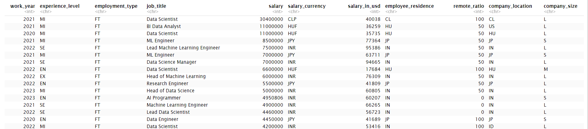
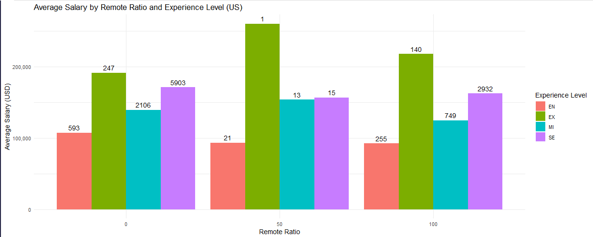
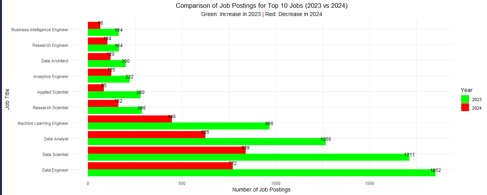
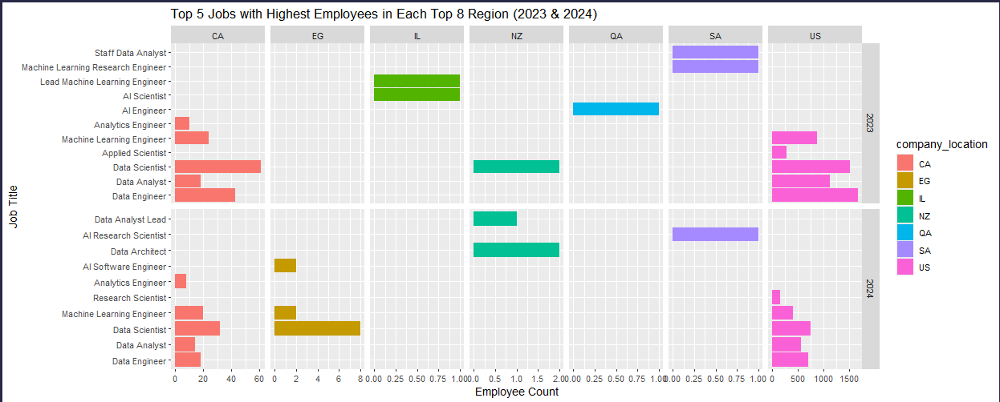
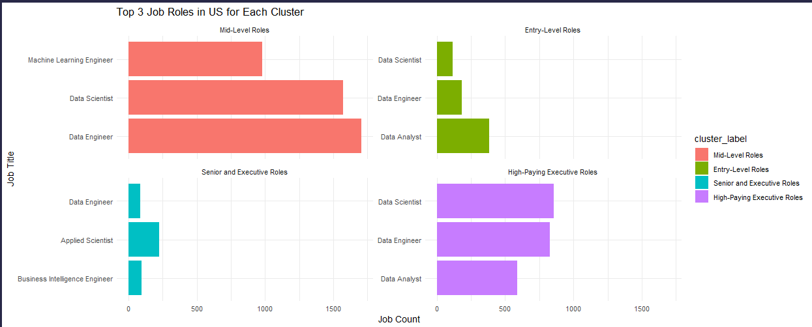
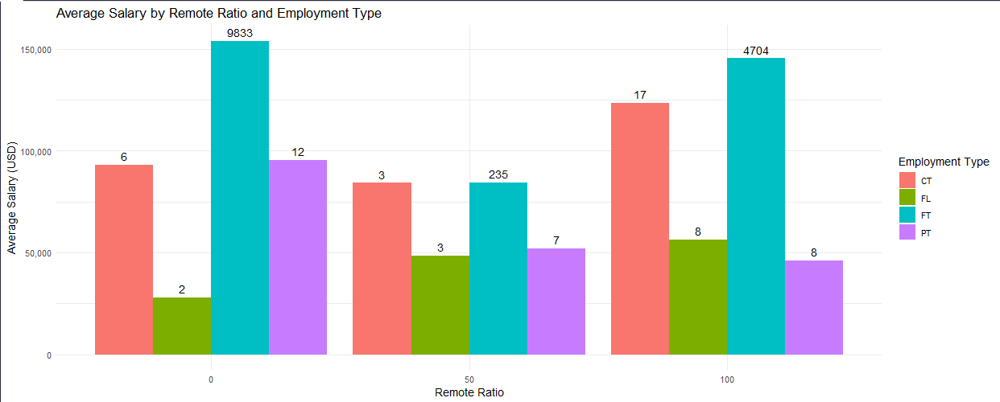
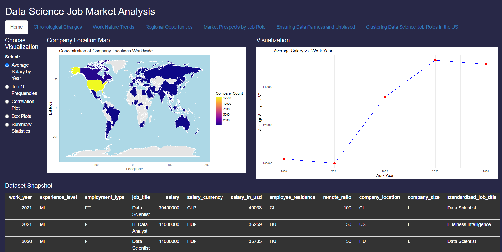

# Data Science Job Market Analysis (2020-2024)

## Project Overview
This project explores the trends and insights from the data science job market between 2020 and 2024. Using R and various data visualization techniques, the project examines factors like salary distributions, regional job opportunities, the impact of remote work, and job trends across multiple dimensions.

## Tools and Libraries Used
- **R**: For data analysis and visualization
- **ggplot2**: To create detailed visualizations
- **dplyr**: For data manipulation
- **Shiny**: To build an interactive dashboard for dynamic data exploration
- **Cluster**: To perform K-means clustering for job role segmentation

## Key Analyses

### 1. Data Summary
- The dataset includes variables such as work year, job title, experience level, employment type, salary, remote ratio, company location, and company size.
- The analysis begins with a summary of the dataset and checks for null values.

### 2. Salary Trends by Experience and Employment Type
- Analyzed the impact of experience levels (Entry, Mid-level, Senior, and Executive) and employment types (Full-Time, Part-Time, Contract, Freelance) on average salaries.

### 3. Chronological Changes in Job Postings
- The number of data science job postings spiked in 2023 but declined in 2024, indicating a possible market saturation post-COVID.

### 4. Regional Salary Analysis
- A deep dive into regional salaries showed that Qatar, Israel, and Puerto Rico offer the highest average salaries for data science roles, while the US and Canada have the largest job markets.

### 5. Clustering Analysis
- K-means clustering segmented job roles in the US based on salary, experience, and company size, highlighting four clusters that represent different levels of job roles and salaries.

### 6. Remote Work and Salary
- Analyzed how the remote work ratio impacts salaries, showing that fully remote and in-person roles command higher average salaries compared to hybrid roles.

## Interactive Dashboard
- A Shiny dashboard was created to explore the data interactively, providing visualizations of salary trends, job opportunities, and the impact of remote work on compensation.

## Future Work
- Further analysis could include examining the effects of educational background and certifications on salary and job trends, as well as analyzing new data from 2025 onward.

## How to Run the Project
1. Clone the repository.
2. Install the required packages listed in the `install.packages()` section of the R script.
3. Launch the Shiny app to explore the interactive dashboard.
